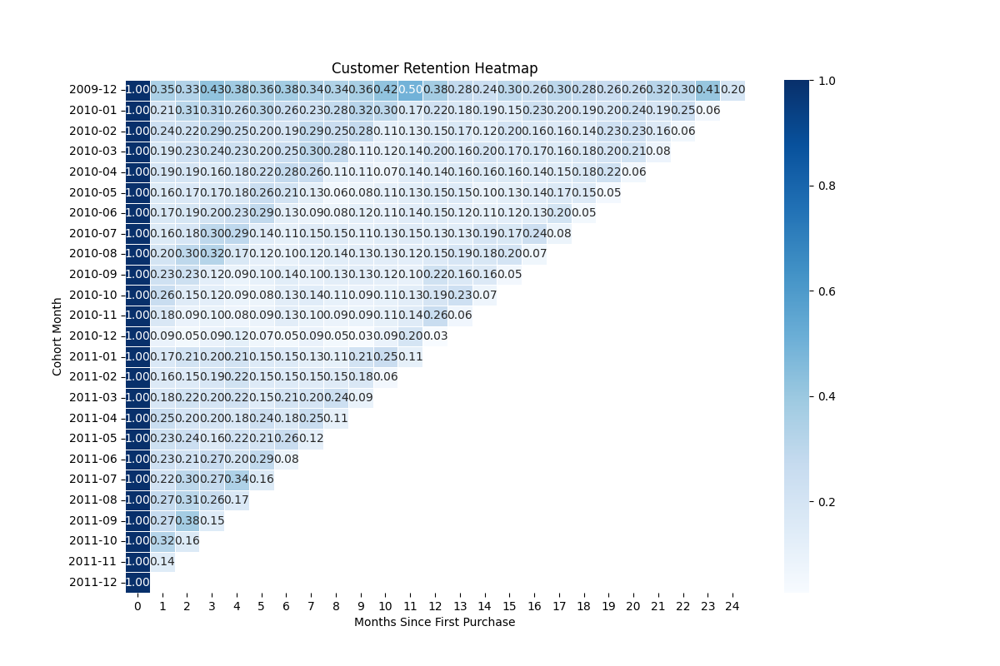

## Data Exploration

In this step, the Online Retail II dataset was loaded and explored.

In this step, we checked:

- Dataset shape and structure
- Data types validation 
- Missing values
- Negative quantities (returns)
- Zero or negative price 
- Cancelled invoices

Main findings:

- 1,067,371 - total rows
- 243,007 - missing Customer Id
- 22,950 - negative quantities
- 6,207 - zero or negative prices 
- 19,494 - cancelled invoices

## Data Cleaning

In this step, the dataset was cleaned and prepared for analysis.

- Removed rows with missing Customer Id
- Removed cancelled invoices
- Removed negative quantities (returns)
- Removed zero or negative prices
- Converted InvoiceDate to datetime format
- Created Revenue column

The Dataset is ready for cohort analysis.

## Database Creation 

In this step, the cleaned dataset was saved into a SQLite database.

What was done:
- Created a SQLite database.
- Saved cleaned data into a table `orders`

Database file created : `database/customer_retention.db`
Table available: `orders`

## Cohort Analysis

In this step, cohort data was prepared using SQL.

What was done:

- Identified each customer's first purchase date 
- Assigned each customer to a cohort based on their first purchase month (`cohort_month`)
- Extracted the order month for each transaction (`order_month`)
- Calculated the number of months since the first purchase (`months_since_first_purchase`)

Result:

A new dataset `cohort_data` was created containing:
- `customer_id`
- `first_purchase_date`
- `cohort_month`
- `order_month`
- `months_since_first_purchase`

## Cohort Table Creation 

In this step, a cohort dataset was created and saved as a table in the database.

As a result a new table ws created - `cohort_data`

this table will be used for retention analysis.

## Retention Aggregation 

In this step, I calculated customer retention by cohort over time.

The goal is to understand how many customers return after their first purchase and how retention evolves across months.

What was done:
- Used `cohort_data` table 
- Grouped data by:
  - `cohort_month`
  - `months_since_first_purchase`
- Calculated number of `active_customers` 

## Retention Rate

In this step, I calculated retention rate for each cohort over time.

What was done:
- Counted active clients per cohort
- Defined cohort size (month 0)
- Calculated retention rate

Result:
Got retention metric to compare cohorts.

## Cohort Pivot (Python)

In this step I created a pivot table to better understand retention by cohort.

What was done:
- Connected to SQL dataset
- Loaded retention data into pandas
- Build pivot table
- Saved result as CSV file

Now retention is structured as a matrix , which is easier to analyze and visualize.

## Visualization

In this step I created a Retention Heatmap.

What was done:
- Loaded cohort pivot table from CSV
- Built heatmap using seaborn
- Saved result as image

File:

## BUSINESS INSIGHTS

The goal is to understand how customer retention changes over time and between cohorts.

# What I see

- All cohorts start with 100% retention in month 0 (expected)
- There is a sharp drop from month 0 to month 1 across all cohorts
- After that, retention decreases more gradually
- Earlier cohorts (2009-2010) tend to have slightly better retention than later ones

# Insights

- The biggest loss of customers happens right after the first purchase 
  ( many customers do not return for a second order)
- Customers who stay after the first month are most likely to stay longer 
  (retention curve becomes more stable over time)
- Newer cohorts show weaker retention 
  (possible changes in product, marketing or customer quality)

# Hypotheses

- Customers might not see enough value after the first purchase
  (lack of follow-up communication , promotions or onboarding)
- Traffic quality may have changed over time
  (newer cohorts could come from lower-quality marketing channels)

# Conclusion 

The main problem is early churn.
Improving the first user experience and encouraging a second purchase could significantly increase overall retention.